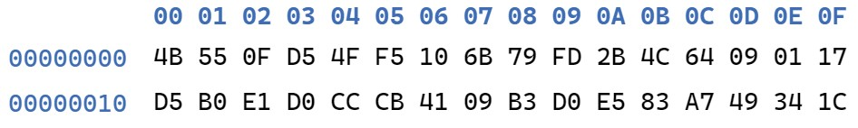
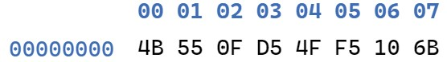
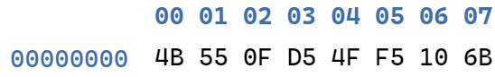

# 信息安全技术 DES 实现
17364025 贺恩泽

## 置换算法
对于 IP 置换、IP-1 逆置换、PC-1 置换和 PC-2 置换等，可以编写以下算法做通用的处理：
```cpp
uint64_t transform(const int* table, uint64_t data, int bit_size, int count) {
    uint64_t ret = 0;
    for (int i = 0; i < count; i++) {
        ret = (ret << 1) | ((data >> (bit_size - *(table + i))) & 0x1);
    }

    return ret;
}
```

该函数的第一个参数 `table` 接收用于变换的表，第二个参数 `data` 为实际变换的数据，第三个参数 `bit_size` 是位长，第四个参数 `count` 是输出的位长。

该算法通过 `count` 次迭代，每次将 `ret` 左移一位并补上数据对应位进行查表变换后的一位，组成最终的变换后结果。

## 初始置换
有了上述的置换算法，进行初始置换只需要将 IP 表传入置换函数，并指定数据和输入输出的位长即可：
```cpp
uint64_t ip_ret = transform(IP, data, 64, 64);
```

其中，IP 表如下：
```cpp
const int IP[] = {
    58,50,42,34,26,18,10,2,
    60,52,44,36,28,20,12,4,
    62,54,46,38,30,22,14,6,
    64,56,48,40,32,24,16,8,
    57,49,41,33,25,17,9,1,
    59,51,43,35,27,19,11,3,
    61,53,45,37,29,21,13,5,
    63,55,47,39,31,23,15,7
};
```

## 子密钥生成
DES 算法中需要用到子密钥，子密钥是根据输入的密钥生成 16 个子密钥。

生成子密钥需要将输入的密钥的非校验位进行 PC-1 置换，然后取出高低 28 位 C、D，再生成 16 个 48 位子密钥。此过程中需要不断对 C、D 进行循环左移，当计算第 1、2、9 和 16 个子密钥时需要循环左移 1 位，否则需要 2 位：
```cpp
void gen_subkeys(uint64_t key, uint64_t* subkeys) 
    // PC-1 置换
    uint64_t pc1_ret = transform(PC1, key, 64, 56);
    uint32_t C = (pc1_ret >> 28) & 0xFFFFFFF;
    uint32_t D = pc1_ret & 0xFFFFFFF;
    const int shift_bit[] = { 1,1,2,2,2,2,2,2,1,2,2,2,2,2,2,1 };
    for (int i = 0; i < 16; i++) {
        // 循环左移
        for (int j = 0; j < shift_bit[i]; j++) {
            C = ((C << 1) & 0xFFFFFFF) | ((C >> 27) & 0x1);
            D = ((D << 1) & 0xFFFFFFF) | ((D >> 27) & 0x1);
        }
        // 组合 CD 到 56 位数据
        uint64_t CD = ((uint64_t)C << 28) | (uint64_t)D;
        // PC-2 置换
        *(subkeys + i) = transform(PC2, CD, 56, 48);
    }
}
```

对于每一次得到的 C 和 D，组合成 56 位数据后进行 PC-2 置换即可得到一个子密钥。

PC-1 和 PC-2 置换使用的表如下：
```cpp
// PC-1
const int PC1[] = {
    57,49,41,33,25,17,9,
    1,58,50,42,34,26,18,
    10,2,59,51,43,35,27,
    19,11,3,60,52,44,36,
    63,55,47,39,31,23,15,
    7,62,54,46,38,30,22,
    14,6,61,53,45,37,29,
    21,13,5,28,20,12,4
};

// PC-2
const int PC2[] = {
    14,17,11,24,1,5,
    3,28,15,6,21,10,
    23,19,12,4,26,8,
    16,7,27,20,13,2,
    41,52,31,37,47,55,
    30,40,51,45,33,48,
    44,49,39,56,34,53,
    46,42,50,36,29,32
};
```

## 16 轮迭代
IP 置换完成后开始 16 轮迭代，首先计算 IP 置换后的 L 和 R：
```cpp
uint32_t L = (uint32_t)((ip_ret >> 32) & 0xFFFFFFFF);
uint32_t R = (uint32_t)(ip_ret & 0xFFFFFFFF);
```

然后在循环中进行迭代 T：
```cpp
// 16 轮迭代 T
for (int i = 0; i < 16; i++) {
    // E 扩展
    uint64_t ext_ret = transform(E, R, 32, 48);
    ext_ret ^= is_encrypt ? *(subkeys + i) : *(subkeys + 15 - i);
    // S 盒
    uint64_t sbox_ret = sbox(ext_ret);
    // P 置换
    uint32_t f_ret = (uint32_t)transform(P, sbox_ret, 32, 32);
    // 交换置换 W
    uint32_t temp = L;
    L = R;
    R = temp ^ f_ret;
}
```

### E 扩展
该过程将 32 位的串做 E 扩展，得到 48 位的串，利用上述置换算法可以轻松完成：
```cpp
uint64_t ext_ret = transform(E, R, 32, 48);
```

用于变换的 E 表如下：
```cpp
const int E[] = {
    32,1,2,3,4,5,
    4,5,6,7,8,9,
    8,9,10,11,12,13,
    12,13,14,15,16,17,
    16,17,18,19,20,21,
    20,21,22,23,24,25,
    24,25,26,27,28,29,
    28,29,30,31,32,1
};
```

对于加密或解密，需要给扩展后的结果分别异或第 i 个子密钥或倒数第 i 个子密钥：
```cpp
ext_ret ^= is_encrypt ? *(subkeys + i) : *(subkeys + 15 - i);
```

### S 盒转换
S 盒的设计直接决定了加密算法的好坏，DES 算法采用一个 8*64 的 S 盒进行 S 盒转换：
```cpp
const int SBOX[8][64] = {
    // S1
    {
        14,4,13,1,2,15,11,8,3,10,6,12,5,9,0,7,
        0,15,7,4,14,2,13,1,10,6,12,11,9,5,3,8,
        4,1,14,8,13,6,2,11,15,12,9,7,3,10,5,0,
        15,12,8,2,4,9,1,7,5,11,3,14,10,0,6,13
    },
    // S2
    {
        15,1,8,14,6,11,3,4,9,7,2,13,12,0,5,10,
        3,13,4,7,15,2,8,14,12,0,1,10,6,9,11,5,
        0,14,7,11,10,4,13,1,5,8,12,6,9,3,2,15,
        13,8,10,1,3,15,4,2,11,6,7,12,0,5,14,9
    },
    // S3
    {
        10,0,9,14,6,3,15,5,1,13,12,7,11,4,2,8,
        13,7,0,9,3,4,6,10,2,8,5,14,12,11,15,1,
        13,6,4,9,8,15,3,0,11,1,2,12,5,10,14,7,
        1,10,13,0,6,9,8,7,4,15,14,3,11,5,2,12
    },
    // S4
    {
        7,13,14,3,0,6,9,10,1,2,8,5,11,12,4,15,
        13,8,11,5,6,15,0,3,4,7,2,12,1,10,14,9,
        10,6,9,0,12,11,7,13,15,1,3,14,5,2,8,4,
        3,15,0,6,10,1,13,8,9,4,5,11,12,7,2,14
    },
    // S5
    {
        2,12,4,1,7,10,11,6,8,5,3,15,13,0,14,9,
        14,11,2,12,4,7,13,1,5,0,15,10,3,9,8,6,
        4,2,1,11,10,13,7,8,15,9,12,5,6,3,0,14,
        11,8,12,7,1,14,2,13,6,15,0,9,10,4,5,3
    },
    // S6
    {
        12,1,10,15,9,2,6,8,0,13,3,4,14,7,5,11,
        10,15,4,2,7,12,9,5,6,1,13,14,0,11,3,8,
        9,14,15,5,2,8,12,3,7,0,4,10,1,13,11,6,
        4,3,2,12,9,5,15,10,11,14,1,7,6,0,8,13
    },
    // S7
    {
        4,11,2,14,15,0,8,13,3,12,9,7,5,10,6,1,
        13,0,11,7,4,9,1,10,14,3,5,12,2,15,8,6,
        1,4,11,13,12,3,7,14,10,15,6,8,0,5,9,2,
        6,11,13,8,1,4,10,7,9,5,0,15,14,2,3,12
    },
    // S8
    {
        13,2,8,4,6,15,11,1,10,9,3,14,5,0,12,7,
        1,15,13,8,10,3,7,4,12,5,6,11,0,14,9,2,
        7,11,4,1,9,12,14,2,0,6,10,13,15,3,5,8,
        2,1,14,7,4,10,8,13,15,12,9,0,3,5,6,11
    }
};
```

在该过程中，将 6 位输入的第 1 位和最后 1 位组成的二进制作为行号，剩余位组成列号查找 S 盒表得到输出：
```cpp
uint32_t sbox(uint64_t key) {
    const int shift_bit[] = { 0,5,1,2,3,4 };
    uint32_t ret = 0;

    for (int i = 0; i < 8; i++) {
        uint64_t row = 0, col = 0;
        // 计算行列号
        for (int j = 0; j < 6; j++) {
            if (j < 2) {
                row = (row << 1) | ((((key >> (42 - i * 6)) & 0x3F) >> (5 - shift_bit[j])) & 0x1);
            }
            else {
                col = (col << 1) | ((((key >> (42 - i * 6)) & 0x3F) >> (5 - shift_bit[j])) & 0x1);
            }
        }
        // 取 S 盒值并左移
        ret = (ret << 4) | ((uint32_t)SBOX[i][(row << 4) + col] & 0xF);
    }

    return ret;
}
```

最后 8 次 S 盒变换将能得到一个 48 位的最终输出。

### P 置换
S 盒转换完毕后，需要进行一次 P 置换，该置换需要用到的表如下：
```cpp
const int P[] = {
    16,7,20,21,
    29,12,28,17,
    1,15,23,26,
    5,18,31,10,
    2,8,24,14,
    32,27,3,9,
    19,13,30,6,
    22,11,4,25
};
```

然后使用该表调用置换函数即可：
```cpp
uint32_t f_ret = (uint32_t)transform(P, sbox_ret, 32, 32);
```

### 交换置换 W
上述置换完成后则进行交换置换 W：
```cpp
uint32_t temp = L;
L = R;
R = temp ^ f_ret;
```

## 逆置换 IP-1
16 轮迭代完成后，将 L 和 R 重新组合位 64 位数据：
```cpp
uint64_t exchange_ret = ((uint64_t)L) | ((uint64_t)R << 32);
```
然后进行 IP-1 逆置换即可：
```cpp
uint64_t ret = transform(IP_INV, exchange_ret, 64, 64);
```

该置换用到的表如下：
```cpp
const int IP_INV[] = {
    40,8,48,16,56,24,64,32,
    39,7,47,15,55,23,63,31,
    38,6,46,14,54,22,62,30,
    37,5,45,13,53,21,61,29,
    36,4,44,12,52,20,60,28,
    35,3,43,11,51,19,59,27,
    34,2,42,10,50,18,58,26,
    33,1,41,9,49,17,57,25
};
```

最后 DES 算法结束，得到加密或解密的结果。

## 测试
为了便于测试，编写一个用于加密和解密文件的函数：
```cpp
uint64_t to_uint64(uint8_t* buffer) {
    uint64_t ret = 0;
    for (int i = 0; i < 8; i++) {
        ret = (ret << 8) | (uint64_t)(*(buffer + i));
    }
    return ret;
}

void to_bytes(uint64_t data, uint8_t* buffer) {
    for (int i = 0; i < 8; i++) {
        *(buffer + i) = (data >> (56 - 8 * i)) & 0xFF;
    }
}

void des_file(char* in_filename, char* out_filename, const char* key_filename, bool is_encrypt) {
    // 打开文件
    FILE* in_file = fopen(in_filename, "rb"),
        * out_file = fopen(out_filename, "wb+"),
        * key_file = fopen(key_filename, "rb");

    uint8_t buf[8] = { 0 };
    // 加载密钥
    fread(buf, sizeof(uint8_t), 8, key_file);
    uint64_t key = to_uint64(buf);
    fclose(key_file);

    uint64_t fsize = ftell(in_file);
    uint64_t buf_len = 0;
    // 每次处理 64 位数据
    while ((buf_len = fread(buf, sizeof(uint8_t), 8, in_file))) {
        // 每次减少读入的大小
        fsize -= buf_len;
        uint64_t ret = 0;
        int valid_len = 0;
        // 如果是加密则进行填充
        if (is_encrypt) {
            for (uint64_t i = buf_len; i < 8; i++) {
                buf[i] = (uint8_t)buf_len;
            }
            ret = des_block(to_uint64(buf), key, is_encrypt);
            valid_len = 8;
        }
        // 如果是解密则将最后不足 8 位的跳过
        else if (buf_len == 8) {
            ret = des_block(to_uint64(buf), key, is_encrypt);
            valid_len = fsize == 0 ? ((ret & 0xF) > 8 ? 8 : (ret & 0xF)) : 8;
        }
        to_bytes(ret, buf);
        // 写入文件
        fwrite(buf, sizeof(uint8_t), valid_len, out_file);
    }

    fclose(in_file);
    fclose(out_file);
}
```

然后编写一个 main 函数以便于外部调用：
```cpp
int main(int argc, char** argv) {
    if (argc < 5) {
        printf("usage: DES.exe -[E|D] key input output\n\n\t-E\tEncrypt a file.\n\t-D\tDecrypt a file.\n\nExample: DES.exe -E key.bin input.bin output.bin");
        return 0;
    }
    bool is_encrypt = (*(argv + 1))[1] == 'E';
    des_file(*(argv + 3), *(argv + 4), *(argv + 2), is_encrypt);

    return 0;
}
```

用法：
```none
usage: DES.exe -[E|D] key input output

    -E  Encrypt a file.
    -D  Decrypt a file.

Example: DES.exe -E key.bin input.bin output.bin
```

首先随机取一个密钥 `0x6B8301042C1F73F7` 并将其写入文件作为 `key.bin`，然后准备一个文件 `test.txt`，内容如下：
```none
This is a test text file.
```
然后对其使用该程序进行加密得到 `result.bin`：



再对 `result.bin` 进行解密得到 `result.txt`，查看 `result.txt` 的内容：
```none
This is a test text file.
```

对比 16 进制结果发现也是相同的，可以看到正确解密了出来。

查看自己实现的 DES 对前 8 字节加密后的二进制结果：



下面对比 OpenSSL 的加密结果：



可以发现完全一致，DES 算法实现正确。
