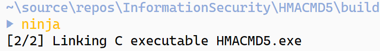
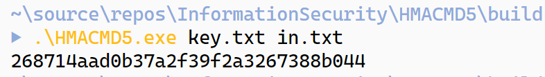
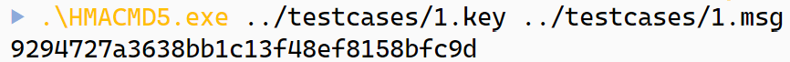
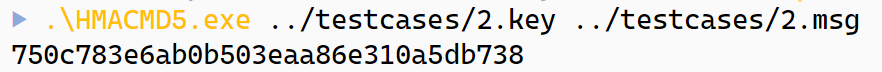
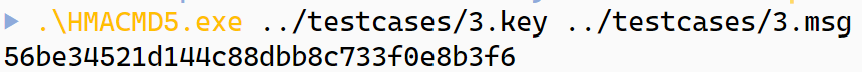
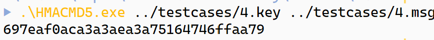
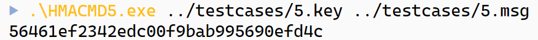
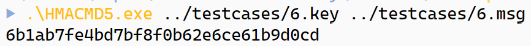
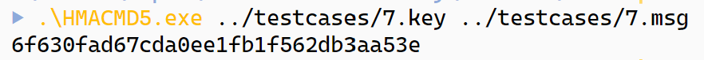

# HMAC-MD5 实验报告
17364025 贺恩泽
## MD5 算法原理概述
MD5 算法是一种信息摘要算法，采用小端模式，输入任意不定长度信息，以 512 位进行分组，生成四个 32 位数据，最后联合输出固定
128 位的信息摘要。该算法可以用来确保信息传输的完整性。

MD5 算法的过程主要为：填充、分块、缓冲区初始化、循环压缩和计算结果。

### 填充
如果输入信息的长度对 512 求余的结果不等于 448，就需要填充使得对 512 求余的结果等于 448，填充的方法是先填充一个 1，然后后面全部填充 0。

### 分块
按照每 512 字节分为 16 组，每个小组 8 字节。

### 初始化
初始化过程中需要初始化 4 个寄存器构成向量 (A, B, C, D)，并采用小端方式存储：

```c
A = 0x67452301;
B = 0xefcdab89;
C = 0x98badcfe;
D = 0x10325476;
```

### 循环压缩
以 512 位消息分组为单位，每一分组 $Y_q (q = 0, 1, ..., L-1)$ 经过 4 个循环的压缩算法，表示如下：

$$
CV_0=IV
$$
$$ 
CV_i=H_{MD5}(CV_{i-1}, Y_{i-1}), i = 1, ..., L
$$

输出结果散列值 $MD = CV_L$

$H_{MD5}$ 从$CV$输入 128 位，从消息分组输入 512 位，完成 4 轮循环后，输出 128 位，作为用于下一轮输入的 CV 值。

每轮循环分别固定不同的生成函数 F, G, H, I，结合指定的 T 表元素 T[] 和消息分组的不同部分 X[] 做 16 次迭代运算，生成下一轮循环的输入。4 轮循环共有64次迭代运算。

该过程用到的 4 个生成函数 g 如下：

```c
F(x, y, z) = (x & y) | (~x & z);
G(x, y, z) = (x & z) | (y & (~z));
H(x, y, z) = x ^ y ^ z;
I(x, y, z) = y ^ (x | (~z));
```

T 表采用如下方式生成：

$$
T[i] = int(2^{32}\times|sin(i)|)
$$

因此构造出如下表：

```c
const unsigned long T[] = {
    0xd76aa478, 0xe8c7b756, 0x242070db, 0xc1bdceee,
    0xf57c0faf, 0x4787c62a, 0xa8304613, 0xfd469501,
    0x698098d8, 0x8b44f7af, 0xffff5bb1, 0x895cd7be,
    0x6b901122, 0xfd987193, 0xa679438e, 0x49b40821,
    0xf61e2562, 0xc040b340, 0x265e5a51, 0xe9b6c7aa,
    0xd62f105d, 0x02441453, 0xd8a1e681, 0xe7d3fbc8,
    0x21e1cde6, 0xc33707d6, 0xf4d50d87, 0x455a14ed,
    0xa9e3e905, 0xfcefa3f8, 0x676f02d9, 0x8d2a4c8a,
    0xfffa3942, 0x8771f681, 0x6d9d6122, 0xfde5380c,
    0xa4beea44, 0x4bdecfa9, 0xf6bb4b60, 0xbebfbc70,
    0x289b7ec6, 0xeaa127fa, 0xd4ef3085, 0x04881d05,
    0xd9d4d039, 0xe6db99e5, 0x1fa27cf8, 0xc4ac5665,
    0xf4292244, 0x432aff97, 0xab9423a7, 0xfc93a039,
    0x655b59c3, 0x8f0ccc92, 0xffeff47d, 0x85845dd1,
    0x6fa87e4f, 0xfe2ce6e0, 0xa3014314, 0x4e0811a1,
    0xf7537e82, 0xbd3af235, 0x2ad7d2bb, 0xeb86d391};
```

在每一轮迭代中，采用如下逻辑进行迭代：

```c
a <- b + ((a + g(b, c, d) + X[k] + T[i]) <<< s)
```

其中，左移运算的 s 按照如下方法取值：
```c
s[1..16] = { 7, 12, 17, 22, 7, 12, 17, 22, 7, 12, 17, 22, 7, 12, 17, 22 }
s[17..32] = { 5, 9, 14, 20, 5, 9, 14, 20, 5, 9, 14, 20, 5, 9, 14, 20 }
s[33..48] = { 4, 11, 16, 23, 4, 11, 16, 23, 4, 11, 16, 23, 4, 11, 16, 23 }
s[49..64] = { 6, 10, 15, 21, 6, 10, 15, 21, 6, 10, 15, 21, 6, 10, 15, 21 }
```

然后将缓冲区循环置换：

```c
(B, C, D, A) <- (A, B, C, D)
```

### 计算结果
所有迭代完成之后，最终的结果由最后的 `(A, B, C, D)` 表示。

## HMAC 算法原理概述
HMAC 算法是一种基于密钥的报文完整性的验证方法，要求通信双方共享密钥、约定算法、对报文进行散列运算，产生一个固定长度的认证码。通信双方通过认证码的校验来确定报文的合法性。

该算法定义如下：

$$
HMAC(K, M)=H((K’⊕opad)|H((K’⊕ipad)|M))
$$

首先，在密钥 K 后面填充 0，如果密钥长度超过 64 则对密钥进行散列运算后将散列值作为密钥。

然后，将上一步生成的结果和 ipad 做异或运算，并将输入数据填充到结果后方。

此时再将第一步中填充后的密钥与 opad 做异或运算，将结果与上一步的结果拼接得到 80 字节的结果。

最后再将上述结果进行散列运算，散列值即为结果。

## 总体结构设计
程序主要由两个部分组成：

- 主函数
- MD5 运算
- HMAC 运算

HMAC 的运算中，散列运算部分会使用 MD5 参与运算。

主函数负责处理用户的输入，并调用 HMAC 和 MD5 算法产生和输出最终的结果。

## 模块分解
为了便于编写和使程序结构清晰，将各模块进行分解：

- MD5 初始化函数：md5_init
- MD5 更新函数，用于根据输入更新当前 MD5 计算的结果：md5_update
- MD5 计算函数，用于计算最终的 MD5 值：md5_final
- HMAC 处理函数，用于根据输入计算 ipad 和 opad 运算后的结果：hmac_init

## 数据结构设计
为了简化编程复杂度并提升结构化程度，增加可读性，设计了如下数据结构：

### 类型定义
为了减少类型声明的长度，定义如下类型简写：
```c
typedef unsigned char u8;
typedef unsigned long u32;
typedef unsigned long long u64;
typedef char i8;
typedef long i32;
typedef long long i64;
```

### 寄存器表示
对于 MD5 的四个寄存器 (A, B, C, D)，采用一个 `state` 数据结构来表示：

```c
typedef union state
{
    struct
    {
        u32 a, b, c, d;
    } self;
    u8 byte[16];
} state;
```

该结构中采用 `union` 使得既可以根据 a、b、c、d 分别访问，也可以通过 byte 直接按字节读取全部的数据。

### 分组
对于 512 位的分组，采用如下数据结构表示：

```c
typedef union buffer
{
    u8 byte[64];
    u32 word[16];
} buffer;
```

采用 `union` 使得可以按 8 位访问和按 32 位进行访问，大大简化了编程的复杂度。

### MD5 上下文
采用一个 `context` 存储 MD5 运算的上下文信息，包含当前分组数据长度、总数据长度以及分组和寄存器信息：

```c
typedef struct context
{
    state state;
    i32 x_len;
    u64 data_len;
    buffer x;
} context;
```

### T 表定义
根据算法：$T[i] = int(2^{32}\times|sin(i)|)$ 预先定义如下 T 表方便后续使用：

```c
const u32 T[] = {
    0xd76aa478, 0xe8c7b756, 0x242070db, 0xc1bdceee,
    0xf57c0faf, 0x4787c62a, 0xa8304613, 0xfd469501,
    0x698098d8, 0x8b44f7af, 0xffff5bb1, 0x895cd7be,
    0x6b901122, 0xfd987193, 0xa679438e, 0x49b40821,
    0xf61e2562, 0xc040b340, 0x265e5a51, 0xe9b6c7aa,
    0xd62f105d, 0x02441453, 0xd8a1e681, 0xe7d3fbc8,
    0x21e1cde6, 0xc33707d6, 0xf4d50d87, 0x455a14ed,
    0xa9e3e905, 0xfcefa3f8, 0x676f02d9, 0x8d2a4c8a,
    0xfffa3942, 0x8771f681, 0x6d9d6122, 0xfde5380c,
    0xa4beea44, 0x4bdecfa9, 0xf6bb4b60, 0xbebfbc70,
    0x289b7ec6, 0xeaa127fa, 0xd4ef3085, 0x04881d05,
    0xd9d4d039, 0xe6db99e5, 0x1fa27cf8, 0xc4ac5665,
    0xf4292244, 0x432aff97, 0xab9423a7, 0xfc93a039,
    0x655b59c3, 0x8f0ccc92, 0xffeff47d, 0x85845dd1,
    0x6fa87e4f, 0xfe2ce6e0, 0xa3014314, 0x4e0811a1,
    0xf7537e82, 0xbd3af235, 0x2ad7d2bb, 0xeb86d391};
```

### 左移位数表
由于 MD5 进行左移 s 位的运算 4 组一个循环，因此可以定义一个左移位数表用来查询需要左移多少位：

```c
const u32 FF_s[] = {7, 12, 17, 22};
const u32 GG_s[] = {5, 9, 14, 20};
const u32 HH_s[] = {4, 11, 16, 23};
const u32 II_s[] = {6, 10, 15, 21};
```

## 关键模块实现
### MD5 初始化函数
初始化过程中需要初始化 4 个寄存器构成向量 (A, B, C, D)，并采用小端方式存储：

```c
A = 0x67452301;
B = 0xefcdab89;
C = 0x98badcfe;
D = 0x10325476;
```

因此编写如下代码用于初始化缓冲区：

```c
void md5_init(context *ctx)
{
    memset(ctx, 0, sizeof(context));
    ctx->state.self.a = 0x67452301;
    ctx->state.self.b = 0xefcdab89;
    ctx->state.self.c = 0x98badcfe;
    ctx->state.self.d = 0x10325476;
}
```

### 生成函数 g
对于 MD5 运算中的生成函数 F、G、H、I，实现如下：
```c
inline u32 F(u32 x, u32 y, u32 z)
{
    return (x & y) | (~x & z);
}

inline u32 G(u32 x, u32 y, u32 z)
{
    return (x & z) | (y & (~z));
}

inline u32 H(u32 x, u32 y, u32 z)
{
    return x ^ y ^ z;
}

inline u32 I(u32 x, u32 y, u32 z)
{
    return y ^ (x | (~z));
}
```

### 实际操作函数
为 F、G、H、I 实现逻辑 `a <- b + ((a + g(b, c, d) + X[k] + T[i]) <<< s)` ：

```c
inline u32 lshift(u32 x, u32 n)
{
    return ((x << n) | ((x & 0xFFFFFFFF) >> (32 - n)));
}

inline u32 FF(u32 a, u32 b, u32 c, u32 d, u32 x, u32 s, u32 ac)
{
    a += F(b, c, d) + x + ac;
    a = lshift(a, s);
    a += b;
    return a;
}

inline u32 GG(u32 a, u32 b, u32 c, u32 d, u32 x, u32 s, u32 ac)
{
    a += G(b, c, d) + x + ac;
    a = lshift(a, s);
    a += b;
    return a;
}

inline u32 HH(u32 a, u32 b, u32 c, u32 d, u32 x, u32 s, u32 ac)
{
    a += H(b, c, d) + x + ac;
    a = lshift(a, s);
    a += b;
    return a;
}

inline u32 II(u32 a, u32 b, u32 c, u32 d, u32 x, u32 s, u32 ac)
{
    a += I(b, c, d) + x + ac;
    a = lshift(a, s);
    a += b;
    return a;
}
```

### 循环置换函数
在每一轮迭代后，需要对缓冲区进行置换：`(B, C, D, A) <- (A, B, C, D)`：

```c
inline void rotate(context *input)
{
    u32 tmp = input->state.self.d;
    input->state.self.d = input->state.self.c;
    input->state.self.c = input->state.self.b;
    input->state.self.b = input->state.self.a;
    input->state.self.a = tmp;
}
```

### 四轮运算

```c
void md5_transform(context *ctx)
{
    u32 last_a = ctx->state.self.a, last_b = ctx->state.self.b, last_c = ctx->state.self.c, last_d = ctx->state.self.d;
    // 第一轮
    // 顺序使用 X[0, 1, 2, 3, 4, 5, 6, 7, 8, 9, 10, 11, 12, 13, 14, 15]
    i32 index = 0;
    for (i32 i = 0; i < 16; i++)
    {
        ctx->state.self.a = FF(ctx->state.self.a, ctx->state.self.b, ctx->state.self.c, ctx->state.self.d, ctx->x.word[index], FF_s[i % 4], T[i]);
        index = (index + 1) % 16;
        // 循环置换
        rotate(ctx);
    }
    // 第二轮
    // 顺序使用 X[1, 6, 11, 0, 5, 10, 15, 4, 9, 14, 3, 8, 13, 2, 7, 12]
    index = 1;
    for (i32 i = 16; i < 32; i++)
    {
        ctx->state.self.a = GG(ctx->state.self.a, ctx->state.self.b, ctx->state.self.c, ctx->state.self.d, ctx->x.word[index], GG_s[i % 4], T[i]);
        index = (index + 5) % 16;
        // 循环置换
        rotate(ctx);
    }
    // 第三轮
    // 顺序使用 X[5, 8, 11, 14, 1, 4, 7, 10, 13, 0, 3, 6, 9, 12, 15, 2]
    index = 5;
    for (i32 i = 32; i < 48; i++)
    {
        ctx->state.self.a = HH(ctx->state.self.a, ctx->state.self.b, ctx->state.self.c, ctx->state.self.d, ctx->x.word[index], HH_s[i % 4], T[i]);
        index = (index + 3) % 16;
        // 循环置换
        rotate(ctx);
    }
    // 第四轮
    // 顺序使用 X[0, 7, 14, 5, 12, 3, 10, 1, 8, 15, 6, 13, 4, 11, 2, 9]
    index = 0;
    for (i32 i = 48; i < 64; i++)
    {
        ctx->state.self.a = II(ctx->state.self.a, ctx->state.self.b, ctx->state.self.c, ctx->state.self.d, ctx->x.word[index], II_s[i % 4], T[i]);
        index = (index + 7) % 16;
        // 循环置换
        rotate(ctx);
    }

    // 加上原来的值
    ctx->state.self.a += last_a;
    ctx->state.self.b += last_b;
    ctx->state.self.c += last_c;
    ctx->state.self.d += last_d;
}
```

### HMAC 初始化运算函数
HMAC 需要将用户的输入和 ipad、opad 进行异或运算，实现如下：

```c
void hmac_init(char *key, char *input, i32 key_len, i32 input_len, u8 **ipad_out, u8 **opad_out)
{
    // 如果 key 长度大于 64 则取 key 的 MD5
    if (key_len > 64)
    {
        context ctx;
        md5_init(&ctx);
        md5_update(&ctx, key, key_len);
        md5_final(&ctx);
        key = ctx.state.byte;
        key_len = 16;
    }
    char *ipad = (char *)malloc(sizeof(char) * (64 + input_len));
    // 将 key 补 0 并与 0x36 进行异或
    for (i32 i = 0; i < 64; i++)
    {
        ipad[i] = (i >= key_len ? 0 : key[i]) ^ 0x36;
    }
    // 在末尾拼接消息
    memcpy(ipad + 64, input, sizeof(char) * input_len);
    *ipad_out = ipad;

    char *opad = (char *)malloc(sizeof(char) * (64 + 16));
    // 将 key 补 0 并与 0x5c 进行异或
    for (i32 i = 0; i < 64; i++)
    {
        opad[i] = (i >= key_len ? 0 : key[i]) ^ 0x5c;
    }
    // 在末尾拼接消息
    memcpy(opad + 64, input, sizeof(char) * 16);
    *opad_out = opad;
}
```

### 算法调用
最终，上述模块实现完毕后对算法进行调用：

```c
// 缓冲区
u8 buffer[64 + 16];
// MD5 上下文
context ctx;

u8 *ipad, *opad;
// 初始化 HMAC 得到 ipad 和 opad 的输出
hmac_init(key, msg, keylen, msglen, &ipad, &opad);
// 计算消息 ipad 输出的 MD5
md5_init(&ctx);
md5_update(&ctx, ipad, 64 + msglen);
md5_final(&ctx);
// 将 opad 的输出和 ipad 输出的 MD5 拼接
memcpy(buffer, opad, 64);
memcpy(buffer + 64, ctx.state.byte, 16);
// 计算 MD5
md5_init(&ctx);
md5_update(&ctx, buffer, 64 + 16);
md5_final(&ctx);
// 输出结果
printf("%0.2x%0.2x%0.2x%0.2x%0.2x%0.2x%0.2x%0.2x%0.2x%0.2x%0.2x%0.2x%0.2x%0.2x%0.2x%0.2x\n", ctx.state.byte[0], ctx.state.byte[1], ctx.state.byte[2], ctx.state.byte[3], ctx.state.byte[4], ctx.state.byte[5], ctx.state.byte[6], ctx.state.byte[7], ctx.state.byte[8], ctx.state.byte[9], ctx.state.byte[10], ctx.state.byte[11], ctx.state.byte[12], ctx.state.byte[13], ctx.state.byte[14], ctx.state.byte[15]);
```

## 编译运行结果
### 编译
本实验报告中采用 ninja 进行构建，也可以采用 make、vs 等工具进行构建。

```bash
mkdir build && cd build
cmake .. -G"Ninja"
ninja
```



### 运行
新建密钥文件 key.txt 和信息文件 in.txt，分别写入 `pass` 和 `hello` 作为密钥和信息。

运行：
```bash
./HMACMD5 key.txt in.txt
```

输出：
```
268714aad0b37a2f39f2a3267388b044
```



使用在线的 HMAC-MD5 工具进行验证发现结果正确。

## 测试
RFC 2202 中给出了 HMAC-MD5 的测试用例如下：

```none
test_case =     1
key =           0x0b0b0b0b0b0b0b0b0b0b0b0b0b0b0b0b
key_len =       16
data =          "Hi There"
data_len =      8
digest =        0x9294727a3638bb1c13f48ef8158bfc9d

test_case =     2
key =           "Jefe"
key_len =       4
data =          "what do ya want for nothing?"
data_len =      28
digest =        0x750c783e6ab0b503eaa86e310a5db738

test_case =     3
key =           0xaaaaaaaaaaaaaaaaaaaaaaaaaaaaaaaa
key_len         16
data =          0xdd repeated 50 times
data_len =      50
digest =        0x56be34521d144c88dbb8c733f0e8b3f6

test_case =     4
key =           0x0102030405060708090a0b0c0d0e0f10111213141516171819
key_len         25
data =          0xcd repeated 50 times
data_len =      50
digest =        0x697eaf0aca3a3aea3a75164746ffaa79

test_case =     5
key =           0x0c0c0c0c0c0c0c0c0c0c0c0c0c0c0c0c
key_len =       16
data =          "Test With Truncation"
data_len =      20
digest =        0x56461ef2342edc00f9bab995690efd4c
digest-96       0x56461ef2342edc00f9bab995

test_case =     6
key =           0xaa repeated 80 times
key_len =       80
data =          "Test Using Larger Than Block-Size Key - Hash Key First"
data_len =      54
digest =        0x6b1ab7fe4bd7bf8f0b62e6ce61b9d0cd

test_case =     7
key =           0xaa repeated 80 times
key_len =       80
data =          "Test Using Larger Than Block-Size Key and Larger Than One Block-Size Data"
data_len =      73
digest =        0x6f630fad67cda0ee1fb1f562db3aa53e
```

下面使用上述 7 个用例进行测试。

### 用例 1


### 用例 2


### 用例 3


### 用例 4


### 用例 5


### 用例 6


### 用例 7


可以看到所有测试用例均计算正确。
