# IPSec 传输模式下 ESP 报文的装包与拆包

## IPSec
IPSec 是互联网安全协定（Internet Protocol Security）的缩写，是一个协议包，通过对IP协议的分组进行加密和认证来保护IP协议的网络传输协议族。

IPSec 主要由以下协议组成：

1. 认证头（AH）：为IP数据报提供无连接数据完整性、消息认证以及防重放攻击保护；
2. 封装安全载荷（ESP）：提供机密性、数据源认证、无连接完整性、防重放和有限的传输流（traffic-flow）机密性；
3. 安全关联（SA）：提供算法和数据包，提供AH、ESP操作所需的参数。
4. 密钥协议（IKE）：提供对称密码的钥匙的生存和交换。

IPSec 对数据进行加密的方式有两种：

1. 传输模式：对 IP 协议报文的有效数据载荷（payload）进行了加密，因此需要对原始 IP 报文进行拆装。

2. 隧道模式：对整个 IP 报文进行加密，在一个安全的隧道中传输整个 IP 报文，保持了原始 IP 报文的完整性。

## ESP
ESP（Encapsulating Security Payloads）协议能够在数据传输过程中对数据进行完整性度量和来源认证、可选择加密以及防止回放保护。

## 装包过程
1. 在原 IP 报文末尾添加 ESP trailer (尾部/挂载) 信息：Padding、Pad length 和 Next header。

    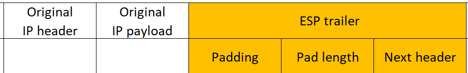

    - 由于所选加密算法可能是块加密，当最后一块长度不足时就需要填充 (padding)，附上填充长度 (Pad length) 方便解包时顺利找出用来填充的那一段数据。
    - Next header 用来标明被封装的原报文的协议类型，例如 4 (= IP)。

2. 将原 IP 报文以及第1步得到的 ESP trailer 作为一个整体进行加密封装。

    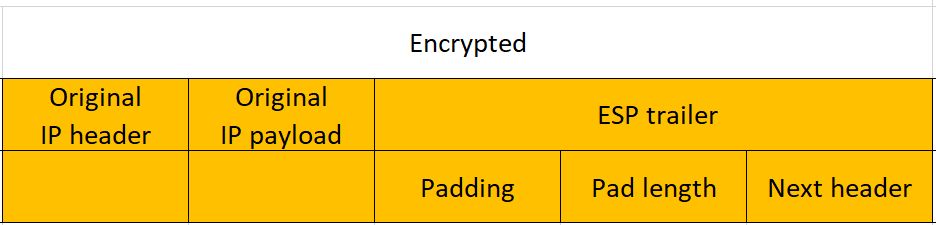

    - 具体的加密算法与密钥由 SA 给出。

3.  为第2步得到的加密数据添加 ESP header。

    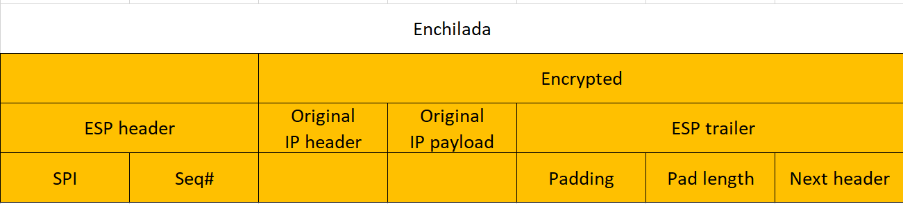

    - ESP header由 SPI 和 Seq# 两部分组成。
    - 加密数据与 ESP header 合称为 “Enchilada”，构成认证部分。

4.  附加完整性度量结果 (ICV，Integrity check value)：对第3步得到的 “enchilada” 部分做认证，得到一个32位整数倍的完整性度量值 (消息认证码 MAC)，并附在 ESP 报文的尾部。

    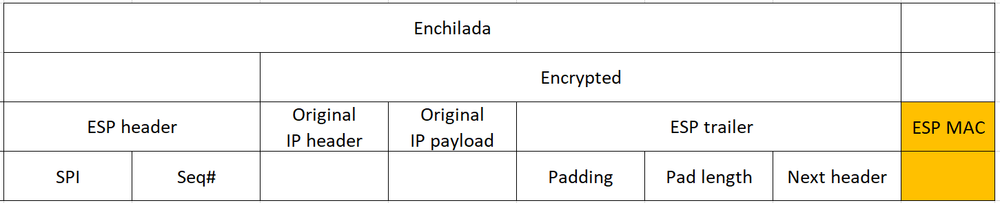

    - 完整性度量算法包括需要的认证密钥由 SA 给出。

5. 加上新的 IP header 构成 IPsec 报文。新构造的 New IP header 附在 ESP 报文的前面组成一个新的 IP 报文，协议类型为50，说明它封装的是一个 ESP 报文。

    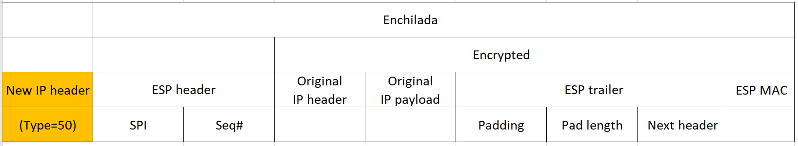

## 拆包过程
1. 接收方收到 IP 报文后，发现协议类型是50，表明这是一个 ESP 包。首先查看 ESP header，通过 SPI 检索数据报文所对应的 SA，读取对应的模式 (tunnel/transport mode) 以及安全规范。

    通过 Type=50 判断报文类型：

    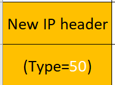

    读取 SPI 检索 SA：

    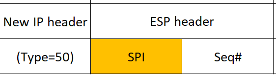

2. 计算 “enchilada” 部分的摘要，与附在末尾的 ICV 做对比，验证数据完整性。

    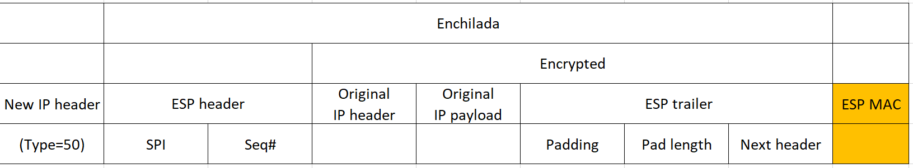

3. 检查 Seq# 里的顺序号，保证数据是“新鲜”的。

    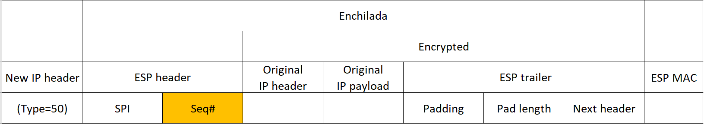

4. 根据 SA 所提供的加密算法和密钥，解密被加密过的数据，得到原 IP 报文与 ESP trailer。

    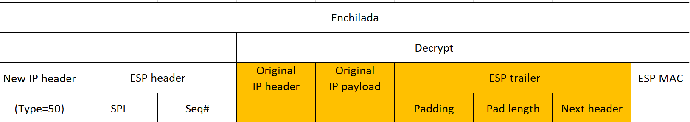

5. 根据 ESP trailer 的填充长度信息，找出填充字段的长度，删去后得到原来的 IP 报文。

    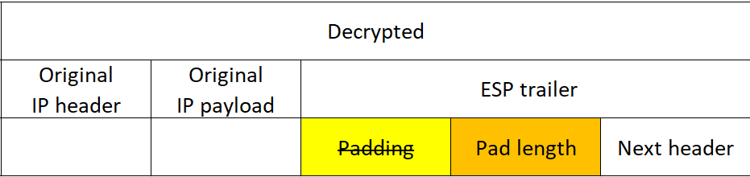

    删掉 Padding 后得到的 IP 报文：

    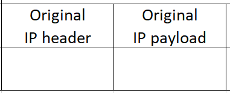

6. 最后根据得到的原 IP 报文的目的地址进行转发。
