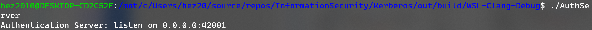
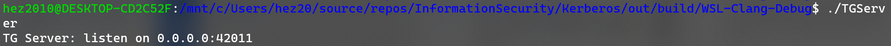
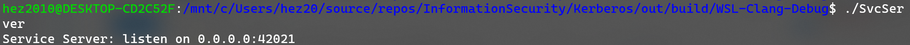
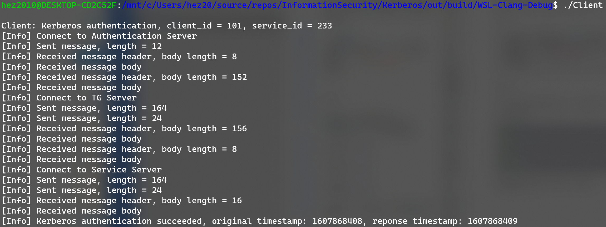
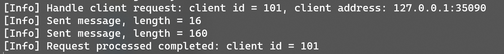
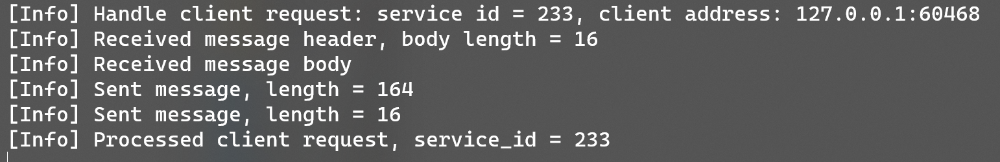
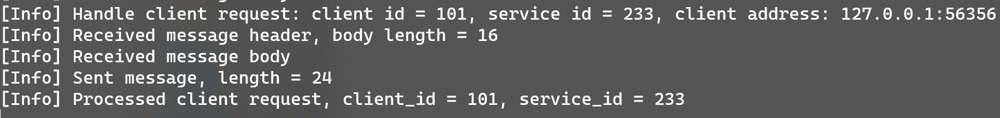

# Kerberos 认证模型实现
17364025 贺恩泽
## 原理概述
Kerberos 基于 Needham & Schroeder’s 协议，构建在对称加密算法之上，并要求一个可信的第三方机构。认证的关键步骤也可以使用非对称加密算法进行。

该认证模型分出以下几个服务：

- Authentication Server
- Ticket-Granting Server
- Service Server

下面分别将其称为 AS、TGS 和 SS。

### 认证过程
#### Client 与 AS 的通信
- Client 向 AS 发送一条请求
- AS 检查数据库是否存在请求的用户 ID，若存在则向 Client 发送：
  - 消息 A：使用和 Client 预先协商好的密钥 $K_{Client}$ 加密一个生成的密钥 $K_{Client-TGS}$
  - 消息 B：使用和 TGS 预先商量好的密钥 $K_{TGS}$ 加密授权票据 TGT，TGT 包含以下信息：
    - 客户 Id、客户网络地址、票据有效期、$K_{Client-TGS}$
  - Client 无法解密消息 B
- Client 收到消息 A 和 B 后，通过密钥 $K_{Client}$ 解密消息 A 得到密钥 $K_{Client-TGS}$，凭借消息 B 向 TGS 证明身份

#### Client 与 TGS 的通信
- Client 向 TGS 发送：
  - 消息 C：服务 Id 和 消息 B
  - 消息 D：使用 $K_{Client-TGS}$ 加密以下信息：
    - 客户 Id、时间戳 TS
- TGS 从消息 C 中获得消息 B，使用 $K_{TGS}$ 解密得到 $K_{Client-TGS}$，然后用其解密消息 D 得到认证内容后，生成会话密钥 $K_{Client-SS}$，向 Client 发送：
  - 消息 E：服务 Id 以及用 $K_{SS}$ 加密的服务票据 ST，ST 包含以下信息：
    - 客户 Id、客户网络地址、票据有效期、$K_{Client-SS}$
  - 消息 F：使用密钥 $K_{Client-TGS}$ 加密的 $K_{Client-SS}$

#### Client 与 SS 的通信
- Client 使用 $K_{Client-TGS}$ 解密消息 F 得到密钥 $K_{Client-SS}$，然后向 SS 发送：
  - 消息 E：先前从 TGS 收到的消息 E
  - 消息 G：使用 $K_{Client-SS}$ 加密以下信息：
    - 客户 Id、时间戳 TS
- SS 使用密钥 $K_{SS}$ 解密消息 E 获得服务票据 ST，从 ST 中得到密钥 $K_{Client-SS}$，再使用 $K_{Client-SS}$ 解密消息 G 得到认证消息，然后提取其中的时间戳 TS，最后向 Client 发送：
  - 消息 H：使用 $K_{Client-SS}$ 加密以下信息：
    - 客户 Id、TS + 1
- Client 使用密钥 $K_{Client-SS}$ 解密消息 H，判断时间戳是否被正确更新，若正确则表示 SS 可以信赖，完成认证

## 数据结构设计
首先定义如下数据类型：

```c
#pragma pack(1)

// 网络消息
typedef struct Message {
    // 消息长度
    u32 length;
    // 消息内容
    u8* data;
} Message;

// 认证票据
typedef struct Ticket {
    // 客户 Id
    int id;
    // 客户地址
    struct sockaddr_storage addr;
    // 票据有效期
    u64 validity;
    // Client-TGS 会话密钥
    u64 key;
} Ticket;

// 客户信息
typedef struct Client {
    // 客户 Id
    int id;
    // 时间戳
    u64 timestamp;
} Client;

// 服务票据
typedef struct ServiceTicket {
    // 客户 Id
    int id;
    // 客户地址
    struct sockaddr_storage addr;
    // 票据有效期
    u64 validity;
    // Client-SS 会话密钥
    u64 key;
} ServiceTicket;

#pragma pack()
```

## 模块分解
由于认证需要客户端向 3 个服务器进行通信，因此分解为 4 个主要模块：

- AuthServer：Authentication Server
- TGServer：Ticket-Granting Server
- SvcServer：Service Server
- Client：Kerberos Client

对称加密算法采用 DES，因此需要一个 DES 模块。

DES 模块在此前的实验中已经完成，因此本次实验中将稍加修改直接使用，不再赘述。

另外，进程之间涉及到网络通信，因此将收发消息也封装为一个独立模块进行使用。

### 网络通信

对于网络通信，封包为消息长度-消息内容的结构，发送时先发送消息长度再发送消息内容，接收时先接收消息长度再根据长度收取内容，这样能有效避免粘包等问题。


因此封装了如下的发送和接收方法：

```c
// 消息写入缓冲区
u32 message_to_buffer(Message* msg, u8** out) {
    u32 length = msg->length * sizeof(u8) + sizeof(u32);
    u8* buffer = (u8*)malloc(length);
    u32 offset = sizeof(msg->length);
    memcpy(buffer, &msg->length, offset);
    memcpy(buffer + offset, msg->data, msg->length);
    *out = buffer;
    return length;
}

// 从缓冲区读取消息
void buffer_to_message(u8* buffer, Message* msg) {
    u32 length;
    memcpy(&length, buffer, sizeof(u32));
    msg->length = length;
    msg->data = (u8*)malloc(length * sizeof(u8));
    memcpy(msg->data, buffer + sizeof(u32), length);
}

// 发送消息
void send_message(int fd, Message* msg) {
    u8* buffer;
    // 将消息写入缓冲区，并获得长度信息
    u32 length = message_to_buffer(msg, &buffer);
    // 发送数据
    send(fd, buffer, length, 0);
    free(buffer);
    printf("[Info] Sent message, length = %lu\n", length);
}

void receive_message(int fd, Message* msg) {
    u32 length;
    // 首先接收消息长度
    recv(fd, &length, sizeof(u32), 0);
    printf("[Info] Received message header, body length = %lu\n", length);
    // 根据长度分配缓冲区，然后接收内容
    u8* buffer = (u8*)malloc(length * sizeof(u8));
    recv(fd, buffer, length, 0);
    // 构建消息
    msg->length = length;
    msg->data = buffer;
    printf("[Info] Received message body\n");
}
```

### Socket 建立
以 AuthService 和 Client 通信为例。

服务器：
```c
// 建立 socket
int server = socket(AF_INET, SOCK_STREAM, 0);
struct sockaddr_in servaddr = {};
// 设置端口等属性
servaddr.sin_family = AF_INET;
servaddr.sin_port = htons(42001);
servaddr.sin_addr.s_addr = htonl(INADDR_ANY);
// 绑定并监听
bind(server, (struct sockaddr*)&servaddr, sizeof(servaddr));
listen(server, 5);
```

客户端：
```c
// 建立 socket
int authServer = socket(AF_INET, SOCK_STREAM, 0);
struct sockaddr_in servaddr = {};
// 设置端口等属性
servaddr.sin_family = AF_INET;
servaddr.sin_port = htons(42001);
servaddr.sin_addr.s_addr = htonl(INADDR_ANY);

printf("[Info] Connect to Authentication Server\n");
// 连接服务器
connect(authServer, (struct sockaddr*)&servaddr, sizeof(servaddr));
```

### 数据收发
以客户端向 AuthService 发送初次请求为例：

```c
// 创建一个消息
Message msg = {};
// 拷贝消息内容
msg.data = malloc(sizeof(int));
memcpy(msg.data, &ClientId, sizeof(int));
// 设置消息长度
msg.length = sizeof(int);
// 发送消息
send_message(authServer, &msg);
```

对于接收，只需要调用 `receive_message` 则会返回一个 `Message`，可以直接使用。

### 认证流程
参考原理概述，认证流程复现了其完整流程。

### 编译运行和测试
编译（本实验使用 ninja 进行构建，也可以通过 make 等工具进行构建）：

```bash
mkdir build && cd build
cmake .. -G"Ninja"
ninja
```

运行：

首先运行 AuthServer、TGServer 和 SvcServer：







最后运行 Client 进行验证和测试：



相应的，上述三个服务器产生输出：







可以看到，认证成功。