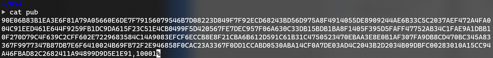

# RSA 算法设计实验报告
17364025 贺恩泽

RSA 是一种常见的非对称加密算法，本次实验的代码实现遵循 PKCS#1 v2.2。

## 密码学原语
RSA 算法采用一堆公钥和私钥分别用于加密和解密，此处使用 `e` 表示公钥，`d` 表示私钥。

为了实现 RSA 算法，需要计算两个大素数 `p` 和 `q`，然后将其相乘得到 `n`。

### 加密 RSAEP
`c = m^e % n`

这里 `m` 为明文，而 `c` 为加密后的密文。

代码实现如下：

```c
void RSAEP(mpz_t m, mpz_t e, mpz_t n, mpz_t* c) {
    mpz_init(*c);
    mpz_powm(*c, m, e, n);
}
```

### 解密 RSADP
`m = c^d % n`

这里 `c` 为密文，而 `m` 为解密后的明文。

代码实现如下：

```c
void RSADP(mpz_t c, mpz_t d, mpz_t n, mpz_t* m) {
    mpz_init(*m);
    mpz_powm(*m, c, d, n);
}
```

## 数据转换
实现 RSA 需要用到两个数据转换函数，分别是：

- I2OSP: 整数转为八位串字符串
- OS2IP: 八位串字符串转为整数

### I2OSP
该函数将整数转为八位串字符串，实现如下：

```c
bool I2OSP(mpz_t x, int xLen, char** ret) {
    // 验证条件：x < 256^xLen
    mpz_t base, r;
    mpz_init(base);
    mpz_init(r);
    mpz_init_set_ui(base, 256);
    mpz_pow_ui(r, base, xLen);
    int cmp = mpz_cmp(x, r);
    if (cmp >= 0) {
        return false;
    }

    mpz_t mod, iter;
    mpz_init(iter);
    mpz_init_set(iter, x);

    // 迭代计算转换为八位串字符串后的每一位
    char* tmpRet = (char*)malloc(xLen);
    for (int i = xLen - 1; i >= 0; i--) {
        mpz_init(mod);
        mpz_mod_ui(mod, iter, 256);
        tmpRet[i] = mpz_get_ui(mod) & 0xff;
        mpz_div_ui(iter, iter, 256);
    }
    *ret = tmpRet;
    return true;
}
```

### OS2IP
该函数将八位串字符串转为整数，实现如下：

```c
void OS2IP(char* x, u64 len, mpz_t* ret) {
    mpz_init(*ret);
    // 迭代每一位相加后进行移位
    for (int i = 0; i < len; i++)
    {
        // 移位
        mpz_mul_ui(*ret, *ret, 256);
        // 加上当前位
        mpz_add_ui(*ret, *ret, x[i] & 0xff);
    }
}
```

## 加密解密
加密解密的编码/解码方式采用 RSAES-PKCS1_v1.5，方法如下：

### 加密过程
1. 检查长度是否满足： `len(M) <= (len(n) − 11)`
2. 编码：
   - `len(PS) = len(n) − len(M) − 3`
   - `PS=0x00||...||0x00`
   - `EM=0x00||0x02||PS||0x00||M`
3. 加密：
   - `m = OS2IP(EM)`
   - `c = RSAEP(m)`
   - `C = I2OSP(c)`
   - `C` 为加密结果

代码实现如下：

```c
bool encrypt(char* M, u64 mLen, mpz_t e, mpz_t n, char** C) {
    // len(M) <= (len(n) − 11)
    int nLen = get_length(n);
    if (mLen > nLen - 11) {
        return false;
    }
    // len(PS) = len(n) − len(M) − 3
    int psLen = nLen - mLen - 3;
    // PS=0x00||...||0x00
    char* PS = (char*)malloc(psLen);
    for (int i = 0; i < psLen; i++) {
        PS[i] = (rand() % 0xff) + 1;
    }
    int emLen = psLen + mLen + 3;
    char* EM = (char*)malloc(emLen);
    // EM=0x00||0x02||PS||0x00||M
    EM[0] = 0;
    EM[1] = 2;
    for (int i = 0; i < psLen; i++) {
        EM[i + 2] = PS[i];
    }
    EM[psLen + 2] = 0;
    for (int i = 0; i < mLen; i++) {
        EM[i + 3 + psLen] = M[i];
    }
    mpz_t m, c;
    // m = OS2IP(EM)
    OS2IP(EM, emLen, &m);
    // c = RSAEP(m)
    RSAEP(m, e, n, &c);
    free(PS);
    free(EM);
    // C = I2OSP(c)
    return I2OSP(c, nLen, C);
}
```

### 解密过程
1. 检查长度是否满足： `len(C) = len(n) >= 11`
2. 解密：
   - `c = OS2IP(C)`
   - `m = RSADP(c)`
   - `EM = I2OSP(m)`
3. 解码：
   - `EM = 0x00||0x02||PS||0x00||M`
   - `M` 为解密结果

实现代码如下：

```c
bool decrypt(char* C, u64 cLen, mpz_t d, mpz_t n, char** M, int* mLen) {
    // len(C) = len(n) >= 11
    int nLen = get_length(n);
    if (cLen != nLen || nLen < 11) {
        return false;
    }
    mpz_t c, m;
    // c = OS2IP(C)
    OS2IP(C, cLen, &c);
    // m = RSADP(c)
    RSADP(c, d, n, &m);
    int emLen = get_length(m);
    char* EM = NULL;
    // EM = I2OSP(m)
    I2OSP(m, emLen, &EM);
    // EM = 0x00||0x02||PS||0x00||M
    if (EM[0] != 0 || EM[1] != 2) {
        return false;
    }
    int index = 0;
    for (int i = 2; i < emLen; i++) {
        if (EM[i] == 0) {
            index = i;
            break;
        }
    }
    if (index == 0) {
        return false;
    }
    // 取出 M
    char* tmpM = (char*)malloc(emLen - (index + 1));
    for (int i = index + 1; i < emLen; i++) {
        tmpM[i - (index + 1)] = EM[i];
    }
    *M = tmpM;
    *mLen = emLen - (index + 1);
    free(EM);
    return true;
}
```

## 测试
### 密钥生成
为了方便进行测试，编写了密钥生成函数。该函数随机生成大素数，直到找到给定长度的密钥为止。

```c
void keygen(int bitLen, mpz_t* e, mpz_t* d, mpz_t* n) {
    gmp_randstate_t random;
    mpz_t p, q;
    // 找到符合要求的素数
    while (true) {
        gmp_randinit_default(random);
        gmp_randseed_ui(random, time(NULL));
        mpz_init(p);
        mpz_init(q);
        // 随机
        mpz_urandomb(p, random, bitLen / 2 - 1);
        mpz_urandomb(q, random, bitLen / 2 + 1);
        mpz_nextprime(p, p);
        mpz_nextprime(q, q);
        mpz_init(*n);
        // n = p * q
        mpz_mul(*n, p, q);
        // 判断 n 的位数是否与用户指定的位数相同
        if (mpz_sizeinbase(*n, 2) == bitLen) {
            break;
        }
    }
    mpz_t phi;
    mpz_init(phi);
    // p - 1
    mpz_sub_ui(p, p, 1);
    // q - 1
    mpz_sub_ui(q, q, 1);
    // phi = (p - 1) * (q - 1)
    mpz_mul(phi, p, q);
    mpz_init(*e);
    mpz_init(*d);
    // 公钥选择 65537
    mpz_init_set_ui(*e, 65537);
    // 求逆元
    mpz_invert(*d, *e, phi);
}
```

### 文件操作
为了便于测试，提供读写文件进行加密解密的功能。这些函数将会从文件中读取输入和密钥，然后调用上述实现好的算法，并且将结果写出到指定文件中。

实现代码如下：

```c
// 生成密钥
int keygen_mode(int bitLen, FILE* publicKey, FILE* privateKey) {
    mpz_t e, d, n;
    keygen(bitLen, &e, &d, &n);
    gmp_fprintf(publicKey, "%ZX,%ZX", n, e);
    gmp_fprintf(privateKey, "%ZX,%ZX", n, d);
    return 0;
}

// 加密
int encrypt_mode(FILE* input, FILE* output, FILE* publicKey) {
    fseek(input, 0, SEEK_END);
    int len = ftell(input);
    fseek(input, 0, SEEK_SET);
    char* M = (char*)malloc(len);
    fread(M, sizeof(char), len, input);
    mpz_t n, e;
    mpz_init(n);
    mpz_init(e);
    gmp_fscanf(publicKey, "%ZX,%ZX", &n, &e);
    int outputLen = get_length(n);
    char* C = NULL;
    if (!encrypt(M, len, e, n, &C)) {
        printf("Failed to decrypt\n");
        return -1;
    }
    fwrite(C, sizeof(char), outputLen, output);
    free(M);
    free(C);
    return 0;
}

// 解密
int decrypt_mode(FILE* input, FILE* output, FILE* privateKey) {
    fseek(input, 0, SEEK_END);
    int len = ftell(input);
    fseek(input, 0, SEEK_SET);
    char* C = (char*)malloc(len);
    fread(C, sizeof(char), len, input);
    mpz_t n, d;
    mpz_init(n);
    mpz_init(d);
    gmp_fscanf(privateKey, "%ZX,%ZX", &n, &d);
    int outputLen;
    char* M = NULL;
    if (!decrypt(C, len, d, n, &M, &outputLen)) {
        printf("Failed to encrypt\n");
        return -1;
    }
    fwrite(M, sizeof(char), outputLen, output);
    free(M);
    free(C);
    return 0;
}
```

### 运行
创建一个内容如下的文本文件 a：
```none
hello~
```

然后先生成密钥：
```bash
./RSA keygen 2048 pub pri
```

得到两个文件 pub 和 pri，分别是公钥和私钥文件。




然后对文件 a 使用公钥进行加密：
```bash
./RSA encrypt a pub b
```
得到加密后的文件 b。

然后对文件 b 使用私钥进行解密：
```bash
./RSA decrypt b pri c
```
得到解密后的文件 c。

查看 c 的内容：


发现与加密前的文件内容一致。

比对其十六进制数据：


可以看到十六进制数据也完全一致，实现正确。

